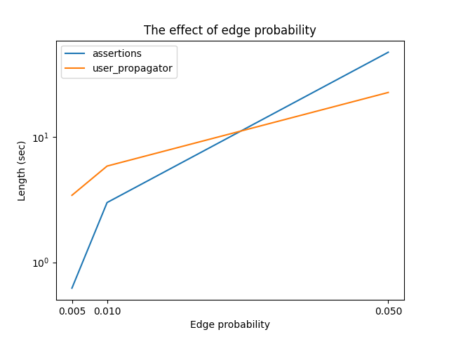
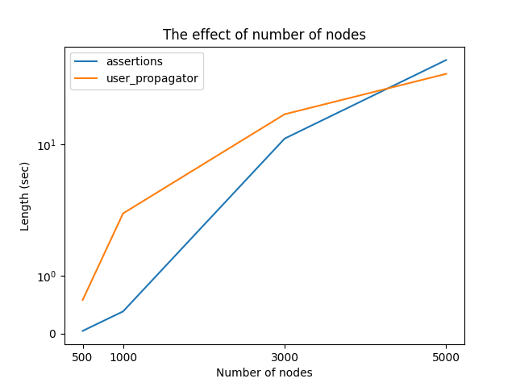
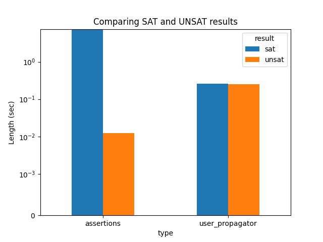

# AVT Homework

> Consultant:
> - Marussy Kristóf

> Created by:
> - Juhász Benedek (C8B5CT)
> - Tumay Ádám (Z7MTDT)

## Description of the task

Out task was to get familiar with the Z3 solver UserPropagator function, apply it to a concrete task, and evaluate the
results.
The concrete task was to check if a graph given as a relation is acyclic.
The motivation for this is to use it in the formal verification of CPUs.
The task is made harder by the fact that the Z3 UserPropagator API is barely documented, there are only C++ and Python
source
codes, and some tutorials available.
To evaluate the results we compared our specialized solution to a standard SMT solution.
The test cases were written by us, but we think they do not represent the real use cases well enough.

## Description of the API

The Z3 solver UserPropagator API provides an interface for the user to add their own propagators to the solver.
The solver uses the propagators together with the standard propagators, and calls them when the conditions specified by
the user are met.
The most important elements of the interface are the create, fix, eq and final, push, pop methods, the most important
callbacks are the add and conflict callback methods.

Short discussion of these most important methods:

- create and add: the propagator works only over the PropagateFunction-s, but not every propagator has to follow every
  such
  instance. When a term is created in the solver, the solver calls the create method of the propagator with this term,
  and the propagator can decide whether to follow the term. If so, it can do so with the add method. Note that even the
  arguments of the term should probably be added, otherwise equality cannot be tracked.
- fix and eq: the solver gives a value to a term, or makes two terms equal. At this point the propagator can signal the
  solver that the value given by the solver is conflicting, but it is not mandatory. Note that terms are not necessarily
  variables, they can be any expression. Only terms which are of bool or bitvector
  sorts are supported in user propagators.
- final: the solver signals that all assertions are satisfied. At this point, if not done yet, the propagators should
  signal the solver that the values given by the solver are conflicting.
- push and pop: these methods group fix and eq operations together, according to the branch-and-bound algorithm, the
  solver can freely jump between these points. Typically, the user should implement the state saving and restoring here.
- conflict: the propagator signals that the values given by the solver are conflicting. The user should try to
  minimize the set of terms involved. A conflict consists of conflicting fixes marked by a list of terms, and
  conflicting equalities, marked by a list of pairs of terms.

A short example usage can be found in our solution file under 'example'.

## Implementation of conflict finding

The cycle finding algorithm is implemented in two ways.

The first algorithm can find a path between two nodes, and given that there is an edge between the last and the first
node, it can find a cycle. It is based on the BFS algorithm.

The second algorithm can find any cycle in a graph, which runs longer, but if called fewer times, it can be faster. It
creates a topological ordering of the nodes, therefore proving that there is no cycle in the graph.

Our data structure keeps track of merged (equated) nodes. The algorithm operated on fictive merged nodes, and when it
finds a cycle, it needs to be normalized back to the original nodes, by substituting the merged nodes with the original
nodes, and listing the merged-node hops in the cycle.

## Test case structure

We created random graphs (Erdős–Rényi model), with certain node numbers, and edge probabilities.
We instantiate a relation that represents this graph, and we add it to the solver.
We also add a handful of 'Or' constraints to the solver, where either 2 nodes or other 2 nodes are asserted as equal.
With this we make it necessary to use branching in the solver.
We add the acyclicity constraint as constraints (see Reference model), or we add it as a propagator.

## Reference model

Acyclicity, as a property of the graph, can also be defined as a constraint with universal quantification:
iff it is acyclic, there is a topological ordering,
iff there is a topological ordering, there is a number we can assign to each node, such that for each edge, the number
assigned to the source node is smaller than the number assigned to the target node on each edge.

## Results and evaluation

### Test set 1: Fix nodes, varying edge probabilities

When the edge probability is low, the graph is sparse, and the SAT solver can easily find a topological ordering, so the
UserPropagator API is slower.
This is because there is a general overhead in the UserPropagator API, that scales with the number of terms registered.
Obviously, if the problem is simple, this overhead is more significant.
When the edge probability is high, the graph is dense, and the SAT solver cannot easily find a topological ordering, so
the UserPropagator API is faster.

### Test set 2: Fix edge probabilities, varying node numbers

The same can be said about the number of nodes.

### Test set 3: SAT problems

We compared the effect of being satisfiable or unsatisfiable on the performance of the UserPropagator API.
The problems we addressed in the first two test sets were unsatisfiable, because they had many edges and nodes,
and as we saw, the UserPropagator API is slower in these cases.
However, the UserPropagator is consistent in speed regardless of the satisfiability of the problem, while the SAT solver
is significantly slower on satisfiable problems.
This is because for proving satisfiability, the SAT solver has to come up with a topological ordering as well, not only
finding a contradictive cycle.

## Conclusion

During testing, we found that the UserProgagator API is slow compared to the standard SMT solution, when it comes to
registering terms. That is, only with complex constraints can it be faster than the standard solution.
We found that our solution scales better with graph complexity, making it better suited for real life formal
verification tasks.

## Ideas to improve the solution

- Implement the 'fresh' method: the current UserPropagator does not support threading.
- Reduce memory usage: the current UserPropagator uses memento pattern to restore state.
- Adjustable conflict finding: implement a way for the user to adjust how frequent the conflict finding algorithm is
  called.
- Return multiple found cycles.
- Propgate lemmas: during traversing the graph, come up with lemmas that can be propagated to the solver.
- Implement in C++: reduces API calling overhead, increases general computation efficiency (may be multithreaded).

## References

- [Reference problem](https://dl.acm.org/doi/pdf/10.1145/3563292)
- [Z3 UserPropagator API tutorial](https://microsoft.github.io/z3guide/programming/Example%20Programs/User%20Propagator/)
- [Z3 UserPropagator API tutorial 2](https://theory.stanford.edu/~nikolaj/programmingz3.html)
